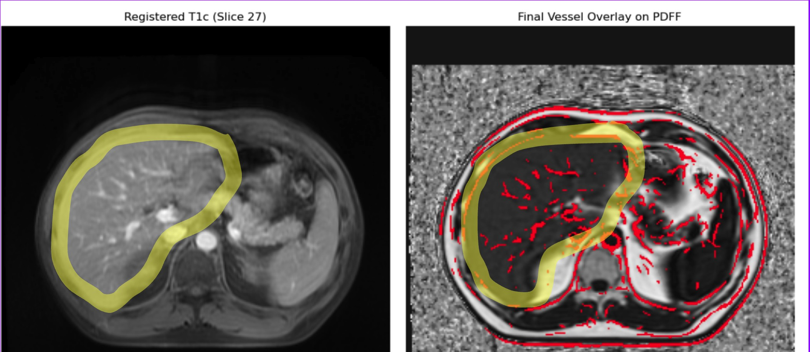
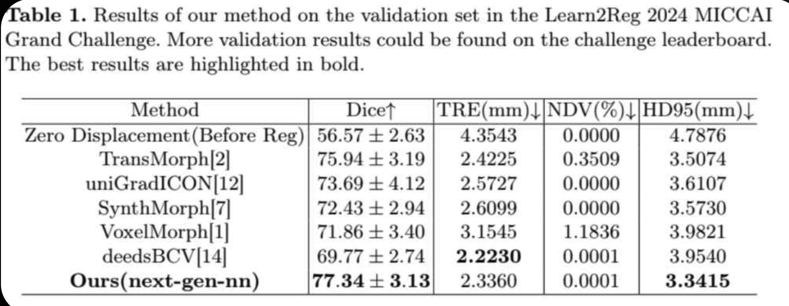

# 利用T1影像優化PDFF肝臟血管分析專案

這是一個醫療影像處理專案，旨在解決 PDFF 序列中肝臟血管對比度不足的問題，以提升後續肝臟分割與脂肪定量分析的準確度。本專案的核心策略是利用同一次掃描中，對比度更清晰的 T1 加權對比增強影像，透過先進的影像對位技術，將其血管資訊對應到 PDFF 影像空間，為後續分析提供更豐富的解剖結構細節。

---

## 核心處理流程

本專案的自動化處理管線包含以下四個關鍵步驟：

1.  **資料載入**：自動讀取指定病人的 T1 Contrast-Enhanced 和 PDFF 兩種 DICOM 影像序列。
2.  **兩階段影像對位**：採用「由粗到精」的策略，先進行快速的**仿射(Affine)對位**校正整體位置，再進行精細的**非剛性B-Spline對位**來擬合局部形變。
3.  **血管結構偵測**：在對位完成的 T1 影像上，使用 **Frangi 濾波器** 來增強並提取血管結構。
4.  **影像疊加與儲存**：將提取出的血管遮罩(Vessel Mask)疊加到原始的 PDFF 影像上，並將結果儲存為一個新的 DICOM 序列。

### 為什麼採用「先剛性，後非剛性」的兩階段對位？

我們的對位流程將一個複雜的問題，拆解成兩個更簡單、更明確的子問題來依序解決。

1.  **第一階段：仿射對位 (快速的全域校正)**
    * **目標**：解決「兩個物體整體上如何擺放才能對齊？」的問題。
    * **作法**：此階段處理的是大幅度的位移、旋轉和縮放。由於演算法參數較少，計算速度快，能迅速地將兩張影像的大致輪廓對齊，為下一步提供一個絕佳的初始狀態，避免後續的精細對位陷入錯誤的「局部最佳解」。

2.  **第二階段：B-Spline 非剛性對位 (精細的局部擬合)**
    * **目標**：解決「在整體對齊後，物體內部的各個小部分如何微調才能完美貼合？」的問題。
    * **作法**：此階段專注於處理因呼吸、不同身體姿態等因素造成的器官局部形變。它基於第一階段的良好結果進行微調，能更有效、更準確地找到最佳的局部形變解。

> **結論**：先用快速的仿射對位解決掉絕大部分的全域性問題，再讓計算量大的非剛性對位去專心處理剩下的局部細節問題，整體流程會更有效率且成果更穩健。

---

#### 成果預覽

#### 成果預覽

> **圖一：互動式對位檢視器。** 由左至右分別為：原始 T1 影像 (Moving Image)、目標 PDFF 影像 (Fixed Image)、以及對位完成後的 T1 影像。
從動畫中可見，透過滑桿操作，能即時檢視不同切片的對位品質，並確認對位後影像的輪廓與結構已和目標影像高度吻合。

> **圖二：最終成果示意圖。** 將對位完成的 T1 影像進行 Frangi 濾波後，提取出的血管結構（紅色），被精準地疊加至目標 PDFF 影像上，為後續的量化分析提供了清晰的基礎。

---

## 評估方法與標準

影像對位的成效評估主要分為「評估形變品質」與「評估解剖結構對齊度」兩類。考量到本專案全自動化的目標，我們現階段採用前者，以**非微分同胚體積 (NDV) %** 作為核心評估指標。

* **外部佐證**：在相關的學術挑戰（如 Learn2Reg 2024）中，NDV 也是衡量頂尖腦部 MRI 對位演算法品質的關鍵指標之一，其數值越小代表形變越理想。
* **目前成果**：在成功案例中，我們開發的流程能夠穩定地達到 **NDV = 0%** 的理想結果。

> 圖：在 Learn2Reg 2024 挑戰賽的公開結果中，多個頂尖方法皆以趨近於零的 NDV 值作為其高品質形變場的證明。

---

## 當前挑戰與下一步規劃

* **當前挑戰：演算法泛化性**
    * **現象**：目前的對位演算法採用固定參數，在部分初始位置差異過大或解剖結構特殊的病人案例上，對位效果不佳。

* **下一步規劃**
    1.  **優化對位穩健性**：導入「多解析度金字塔」對位策略，讓演算法更能適應不同難度的案例。
    2.  **強化血管偵測**：在 Frangi 濾波後加入形態學後處理步驟（如移除微小雜訊），提升最終血管遮罩的乾淨度與一致性。
    3.  **建立失敗案例分析流程**：利用互動式工具，針對目前效果不佳的案例進行根本原因分析與演算法迭代。